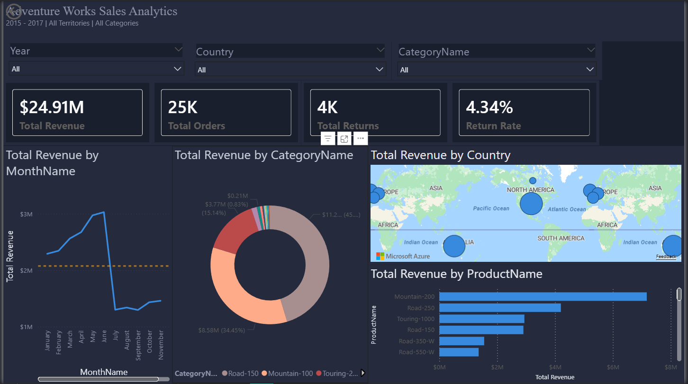
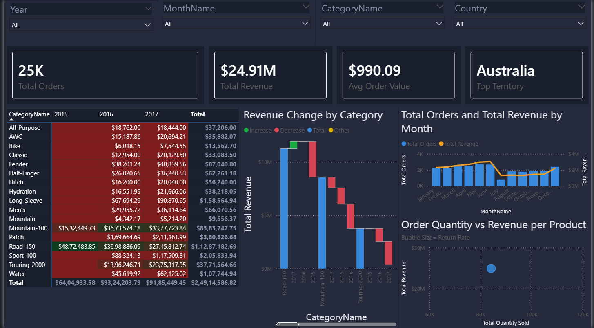
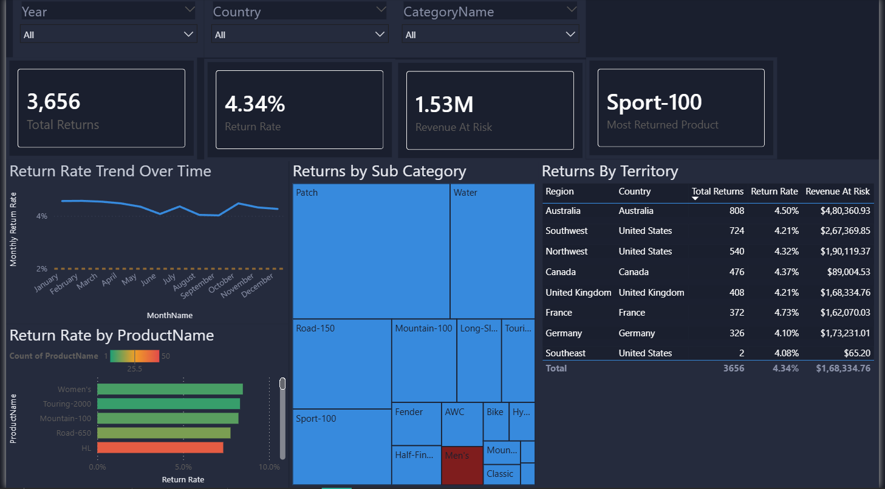

# Azure End-to-End Data Engineering Pipeline
### AdventureWorks Sales Intelligence | Bronze → Silver → Gold → Power BI

An enterprise-grade ELT pipeline built entirely on Microsoft Azure, ingesting AdventureWorks sales data through a full medallion architecture and serving insights via a 3-page interactive Power BI dashboard.

---

## Live Dashboard Screenshots

> Add your 3 screenshots here after uploading them to a `/screenshots` folder

| Executive Overview | Sales Deep Dive | Return Analysis |
|---|---|---|
|  |  |  |

---

## Architecture

```
GitHub API → Azure Data Factory → Azure Data Lake Gen2 → Azure Databricks → Azure Synapse Analytics → Power BI
                (Ingest)              (Bronze/Silver/Gold)     (Transform)         (Serve)              (Visualize)
```

| Layer | Technology | What it does |
|---|---|---|
| Ingest | Azure Data Factory | Dynamic parameterized pipeline with ForEach loops — loads 8 tables in one run from GitHub API |
| Store | Azure Data Lake Storage Gen2 | Medallion architecture with Bronze, Silver, Gold containers |
| Transform | Azure Databricks + PySpark | Data cleaning, type casting, derived columns, null handling |
| Model | Azure Synapse Analytics | External tables and views exposed as star schema |
| Visualize | Power BI | 3-page interactive executive dashboard |

---

## Key Features

- Dynamic ADF pipeline using ForEach loops and parameterized JSON config — eliminates static copy-activity duplication across 8 tables
- Full medallion architecture: Bronze (raw) → Silver (transformed) → Gold (served)
- PySpark transformations including joins, type casting, derived FullName column, and null handling with concat_ws
- Azure Entra ID service principal authentication for secure Databricks-to-ADLS access using Storage Blob Contributor IAM role
- Gold layer exposed as external Parquet tables in Synapse Analytics serverless SQL pool
- 3-page Power BI dashboard with 15+ visuals, DAX measures, and cross-page slicer sync

---

## Dashboard Pages

**Page 1 — Executive Overview**
- KPI cards: Total Revenue ($24.91M), Total Orders (25K), Total Returns (4K), Return Rate
- Monthly revenue trend line chart
- Revenue by category donut chart
- Top 10 products by revenue bar chart
- Revenue by country map visual

**Page 2 — Sales Deep Dive**
- Orders vs Revenue by month combo chart (dual axis)
- Revenue by category and year matrix with conditional formatting
- Revenue change waterfall chart (2015 → 2017)
- Order quantity vs revenue scatter chart (bubble size = return rate)

**Page 3 — Return Analysis**
- Return rate trend over time with 2% threshold reference line
- Returns by subcategory treemap
- Return rate by product bar chart with color gradient
- Returns by territory table with conditional formatting

---

## DAX Measures

```dax
Total Revenue = 
SUMX('gold extsales', 'gold extsales'[OrderQuantity] * RELATED('gold extproducts'[ProductPrice]))

Total Orders = DISTINCTCOUNT('gold extsales'[OrderNumber])

Return Rate = DIVIDE(SUM('gold extreturns'[ReturnQuantity]), SUM('gold extsales'[OrderQuantity]), 0)

Revenue At Risk = 
SUMX('gold extreturns', 'gold extreturns'[ReturnQuantity] * RELATED('gold extproducts'[ProductPrice]))

Revenue YoY % = 
VAR CurrentYear = [Total Revenue]
VAR PrevYear = CALCULATE([Total Revenue], DATEADD('gold extcalendar'[Date], -1, YEAR))
RETURN DIVIDE(CurrentYear - PrevYear, PrevYear, 0)
```

---

## Data Model (Star Schema)

```
extcalendar ──────────────────┐
extcustomers ─────────────────┤
extterritories ───────────────┼──── extsales (fact)
extproducts ──────────────────┘         │
     │                              extreturns
extsubcategories
```

---

## Repository Structure

```
azure-end-to-end-data-engineering/
│
├── datasets/                          ← Raw AdventureWorks CSV files
│   ├── AdventureWorks_Calendar.csv
│   ├── AdventureWorks_Customers.csv
│   ├── AdventureWorks_Products.csv
│   ├── AdventureWorks_Returns.csv
│   ├── AdventureWorks_Sales_2015.csv
│   ├── AdventureWorks_Sales_2016.csv
│   ├── AdventureWorks_Sales_2017.csv
│   └── AdventureWorks_Territories.csv
│
├── adf-pipelines/                     ← Azure Data Factory pipeline JSON exports
│   ├── get_to_raw_static.json
│   └── dynamic_get_to_raw.json
│
├── parameter-files/                   ← Dynamic pipeline config
│   └── get.json
│
├── databricks-notebooks/              ← PySpark transformation notebooks
│   ├── silver_layer_transformations.ipynb
│   └── mounting_storage.ipynb
│
├── synapse-scripts/                   ← Run in this order
│   ├── 1_create_schema.sql
│   ├── 2_create_credentials_and_datasource.sql
│   ├── 3_create_external_fileformat.sql
│   ├── 4_create_external_tables.sql
│   └── 5_create_views_gold.sql
│
├── screenshots/                       ← Dashboard proof of work
│   ├── page1_executive_overview.png
│   ├── page2_sales_deepdive.png
│   ├── page3_return_analysis.png
│   ├── adf_pipeline_success.png
│   ├── bronze_layer_storage.png
│   └── synapse_gold_views.png
│
├── adventureworks_dashboard.pbix      ← Power BI dashboard file
└── README.md
```

---

## How to Reproduce

### Prerequisites
- Microsoft Azure account (free tier works)
- Azure Data Factory, Data Lake Gen2, Databricks, Synapse Analytics
- Power BI Desktop (free)

### Steps

**1. Set up Azure resources**
```
Resource Group → Storage Account (ADLS Gen2) → Azure Data Factory → Databricks Workspace → Synapse Workspace
```

**2. Create storage containers**
```
bronze    ← raw data from ADF
silver    ← transformed data from Databricks  
gold      ← external tables from Synapse
```

**3. Configure ADF pipeline**
- Import pipeline JSONs from `adf-pipelines/`
- Upload `parameter-files/get.json` to parameters container
- Create HTTP linked service pointing to GitHub raw content base URL
- Run `dynamic_get_to_raw` pipeline — loads all 8 tables to bronze

**4. Run Databricks transformations**
- Configure service principal credentials in notebook
- Run `silver_layer_transformations.ipynb`
- Verify silver container has Parquet files for all 8 tables

**5. Run Synapse SQL scripts in order**
```sql
-- Run each file in synapse-scripts/ sequentially (1 → 5)
-- Verify with: SELECT TOP 10 * FROM gold.extsales
```

**6. Connect Power BI**
- Get Data → Azure Synapse Analytics SQL
- Server: `your-workspace-ondemand.sql.azuresynapse.net`
- Import all gold.ext tables
- Open `adventureworks_dashboard.pbix` or rebuild from scratch

---

## Key Learnings & Interview Talking Points

- **Dynamic vs static pipelines**: Built ForEach loop with parameterized JSON instead of repeating copy activities — reduced pipeline complexity by 8x
- **Medallion architecture**: Bronze preserves raw data integrity, Silver applies business transformations, Gold serves analytics-ready star schema
- **Cloud IAM**: Implemented service principal authentication with least-privilege IAM role (Storage Blob Contributor) — production best practice
- **Duplicate data handling**: Resolved Many-to-One relationship failures caused by duplicate keys in dimension tables using Power Query deduplication
- **DAX design**: Separated measures into dedicated table for organization, used DIVIDE() for safe division to prevent division-by-zero errors

---

## Skills Demonstrated

`Azure Data Factory` `Azure Databricks` `PySpark` `Azure Synapse Analytics` `ADLS Gen2` `Power BI` `DAX` `SQL` `Python` `Medallion Architecture` `ELT Pipeline Design` `Star Schema` `Azure Entra ID` `Cloud IAM` `Data Modeling`

---

## Dataset

**Source:** AdventureWorks (Microsoft sample dataset)  
**Tables:** 8 tables — Sales (2015/16/17), Returns, Products, Customers, Calendar, Territories  
**Total records:** ~84,000 sales transactions across 3 years  
**Coverage:** 6 countries, 3 product categories, 2015–2017
